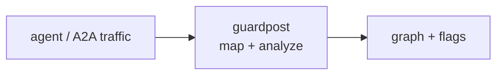

<a name="top"></a>
<div align="center">


# GUARDPOST

### Runtime agent firewall — PII redaction, rate limits, policy enforcement


[](https://pypi.org/project/cognis-guardpost/) [](https://github.com/cognis-digital/guardpost/actions) [](LICENSE) [](https://github.com/cognis-digital)

*AI Security & Governance — securing LLMs, agents, and the MCP supply chain.*

</div>

```bash
pip install cognis-guardpost
guardpost scan .            # → prioritized findings in seconds
```


## Usage — step by step

1. Install (Python 3.9+):
   ```bash
   pip install guardpost
   ```
2. Scan a file (or stdin) for PII and policy violations; redaction is on by
   default:
   ```bash
   guardpost scan request.txt
   cat prompt.txt | guardpost scan -
   ```
3. Tighten the policy: use the strict preset, ban terms, set a rate limit, or
   tag the principal for audit:
   ```bash
   guardpost scan request.txt --strict --rate-limit 60 --principal svc-bot \
       --ban "internal-secret" --ban "api_key"
   ```
4. Read the output: the table shows ALLOWED/BLOCKED, the findings
   (severity/category/kind/excerpt) and the sanitized text. The process exits
   `2` when traffic is BLOCKED, `0` when ALLOWED — wire that into a pipeline.
5. Emit machine-readable findings for a gateway / CI:
   ```bash
   cat prompt.txt | guardpost scan - --strict --format json
   ```

## Contents

- [Why guardpost?](#why) · [Features](#features) · [Quick start](#quick-start) · [Example](#example) · [Architecture](#architecture) · [AI stack](#ai-stack) · [How it compares](#how-it-compares) · [Integrations](#integrations) · [Install anywhere](#install-anywhere) · [Related](#related) · [Contributing](#contributing)

<a name="why"></a>
## Why guardpost?

Runtime agent firewall — PII redaction, rate limits, policy enforcement — without standing up heavyweight infrastructure.

`guardpost` is single-purpose, scriptable, and self-hostable: point it at a target, get prioritized results in the format your workflow already speaks (table · JSON · SARIF), gate CI on it, and let agents drive it over MCP.

<div align="right"><a href="#top">↑ back to top</a></div>

<a name="features"></a>
## Features

- ✅ Scan Pii
- ✅ Redact
- ✅ Scan Policy
- ✅ Fingerprint
- ✅ Guard
- ✅ Runs on Linux/macOS/Windows · Docker · devcontainer
- ✅ Ports in Python, JavaScript, Go, and Rust (`ports/`)

<div align="right"><a href="#top">↑ back to top</a></div>

<a name="quick-start"></a>
## Quick start

```bash
pip install cognis-guardpost
guardpost --version
guardpost scan .                       # scan current project
guardpost scan . --format json         # machine-readable
guardpost scan . --fail-on high        # CI gate (non-zero exit)
```

<div align="right"><a href="#top">↑ back to top</a></div>

<a name="example"></a>
## Example

```text
$ guardpost scan .
  [HIGH    ] GUA-001  example finding             (./src/app.py)
  [MEDIUM  ] GUA-002  another signal              (./config.yaml)

  2 findings · risk score 5 · 38ms
```

<div align="right"><a href="#top">↑ back to top</a></div>

<a name="architecture"></a>
## Architecture



<div align="right"><a href="#top">↑ back to top</a></div>

<a name="ai-stack"></a>
## Use it from any AI stack

`guardpost` is interoperable with every popular way of using AI:

- **MCP server** — `guardpost mcp` (Claude Desktop, Cursor, Cognis.Studio, [uncensored-fleet](https://github.com/cognis-digital/uncensored-fleet))
- **OpenAI-compatible / JSON** — pipe `guardpost scan . --format json` into any agent or LLM
- **LangChain · CrewAI · AutoGen · LlamaIndex** — wrap the CLI/JSON as a tool in one line
- **CI / scripts** — exit codes + SARIF for non-AI pipelines

<div align="right"><a href="#top">↑ back to top</a></div>

<a name="how-it-compares"></a>
## How it compares

| | **Cognis guardpost** | protectai |
|---|:---:|:---:|
| Self-hostable, no account | ✅ | varies |
| Single command, zero config | ✅ | ⚠️ |
| JSON + SARIF for CI | ✅ | varies |
| MCP-native (AI agents) | ✅ | ❌ |
| Polyglot ports (JS/Go/Rust) | ✅ | ❌ |
| Open license | ✅ COCL | varies |

*Built in the spirit of **protectai/llm-guard**, re-framed the Cognis way. Missing a credit? Open a PR.*

<div align="right"><a href="#top">↑ back to top</a></div>

<a name="integrations"></a>
## Integrations

Pipes into your stack: **SARIF** for code-scanning, **JSON** for anything, an **MCP server** (`guardpost mcp`) for AI agents, and a webhook forwarder for SIEM/Slack/Jira. See [`docs/INTEGRATIONS.md`](docs/INTEGRATIONS.md).

<div align="right"><a href="#top">↑ back to top</a></div>

<a name="install-anywhere"></a>
## Install — every way, every platform

```bash
pip install "git+https://github.com/cognis-digital/guardpost.git"    # pip (works today)
pipx install "git+https://github.com/cognis-digital/guardpost.git"   # isolated CLI
uv tool install "git+https://github.com/cognis-digital/guardpost.git" # uv
pip install cognis-guardpost                                          # PyPI (when published)
docker run --rm ghcr.io/cognis-digital/guardpost:latest --help        # Docker
brew install cognis-digital/tap/guardpost                             # Homebrew tap
curl -fsSL https://raw.githubusercontent.com/cognis-digital/guardpost/main/install.sh | sh
```

| Linux | macOS | Windows | Docker | Cloud |
|---|---|---|---|---|
| `scripts/setup-linux.sh` | `scripts/setup-macos.sh` | `scripts/setup-windows.ps1` | `docker run ghcr.io/cognis-digital/guardpost` | [DEPLOY.md](docs/DEPLOY.md) (AWS/Azure/GCP/k8s) |

<div align="right"><a href="#top">↑ back to top</a></div>

<a name="related"></a>
## Related Cognis tools

- [`aegis`](https://github.com/cognis-digital/aegis) — AI Agent Permission & Access Auditor — surfaces the lethal trifecta of credentials + injection + reach
- [`promptmirror`](https://github.com/cognis-digital/promptmirror) — Prompt-injection & indirect-injection scanner for any LLM context input
- [`ledgermind`](https://github.com/cognis-digital/ledgermind) — Local LLM cost & token forensics proxy with anomaly detection
- [`adversa`](https://github.com/cognis-digital/adversa) — LLM red-team harness — OWASP LLM Top 10 + MITRE ATLAS attack packs
- [`hallumark`](https://github.com/cognis-digital/hallumark) — LLM hallucination & grounding auditor for RAG systems
- [`aicard`](https://github.com/cognis-digital/aicard) — Auto-generated NIST AI RMF / EU AI Act Annex IV model & system cards

**Explore the suite →** [🗂️ all 170+ tools](https://github.com/cognis-digital/cognis-neural-suite) · [⭐ awesome-cognis](https://github.com/cognis-digital/awesome-cognis) · [🔗 cognis-sources](https://github.com/cognis-digital/cognis-sources) · [🤖 uncensored-fleet](https://github.com/cognis-digital/uncensored-fleet) · [🧠 engram](https://github.com/cognis-digital/engram)

<div align="right"><a href="#top">↑ back to top</a></div>

<a name="contributing"></a>
## Contributing

PRs, new rules, and demo scenarios are welcome under the collaboration-pull model — see [CONTRIBUTING.md](CONTRIBUTING.md) and [SECURITY.md](SECURITY.md).

> ### ⭐ If `guardpost` saved you time, **star it** — it genuinely helps others find it.

## License

Source-available under the **Cognis Open Collaboration License (COCL) v1.0** — free for personal, internal-evaluation, research, and educational use; **commercial / production use requires a license** (licensing@cognis.digital). See [LICENSE](LICENSE).

---

<div align="center"><sub><b><a href="https://cognis.digital">Cognis Digital</a></b> · one of 170+ tools in the <a href="https://github.com/cognis-digital/cognis-neural-suite">Cognis Neural Suite</a> · <i>Making Tomorrow Better Today</i></sub></div>
